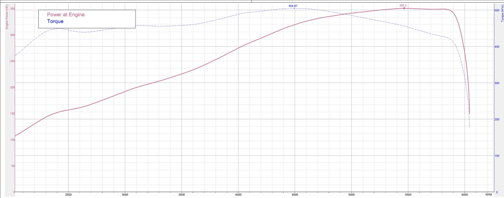
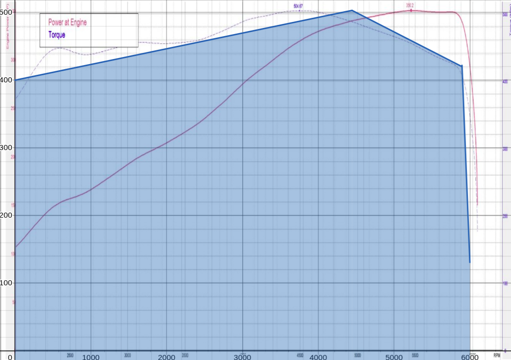
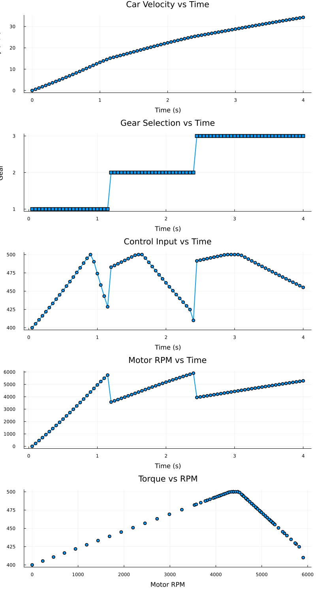
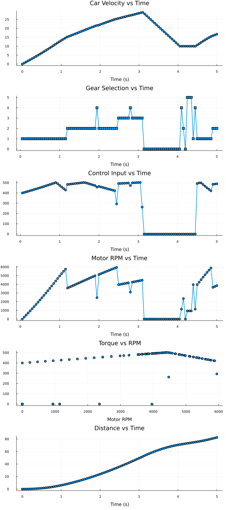

This project features simple car model with combustion engine and 5 stage gearbox. The goal is to find optimal shifting times for the gearbox for two scenarios.
## Scenarios

1. **Straight line**: Find shifting points that maximize travelled distance
2. **Straight line-Curve-Straight line**: Find shifting and braking points, that maximize travelled distance, with addiditonal consstraint on speed during curve

## Car model
Car is modelled as an Mixed Logical Dynamical system, governed by differential equations and constraints:

$$\dot{s} = v,$$

$$\dot{v} = \frac{u \cdot R_{gb}\cdot R_{df}}{m \cdot r_{w}},$$

$$u\leq T_{m}(\omega,R_{gb})$$

where $u$ is motor torque, $R_{gb}$ is gear ratio of gearbox, $R_{df}$ is ratio of differential, $m$ is mass of the car and $r_w$ is radius of driven wheels. To model discrete gear ratios of gearbox, the model is switched between five different affine systems, that differ in $R_{gb}$ and motor map. This is done by using five indicator varibles $\delta_1,\delta_2,\delta_3,\delta_4,\delta_5$ which can be either ${0,1}$. Each indicator variable is size $1 \times N$, which gives $5\times N$  indicator variables.

Then xor is enforced between them, to force only one gear ratio to be active:
$$
\delta_1 \oplus \delta_2 \oplus \delta_3 \oplus \delta_4 \oplus \delta_5 ,
$$
by constraint
$$\delta_1 + \delta_2 + \delta_3 + \delta_4 + \delta_5 = 1$$

## Motor model
Combustion engine is often modelled using RPM -> Max torque map. This was provided by a friend.
 The characteristic map is shown below:

$u$ is constrained by the torque curve. Actual constraints are overlayed here

## Track model
Track modeled as constraints for velocity on given segment. Addtional indicator constraints $s_1,s_2,s_3$ to indicate which segment the car is on are introduced. In the example there are 3 segments so $3\times N$ constraints$. This can be done more efficient. To enforce the car is on exatly one segment at each time:

$$s_1 + s_2 + s_3 =1 .$$
Then speed is limited using contraints
$$s_1 \implies d \leq d_{curve\_start},$$

$$s_2 \implies d_{curve\_start} \leq d \leq d_{curve\_end},$$

$$s_3 \implies d \geq d_{curve\_end},$$

where $d$ is distance travelled and $d_{curve\_start}$, $d_{curve\_end}$ are curve boundaries.

## Results
### Straight acceleration

### Acceleration with path constraints

